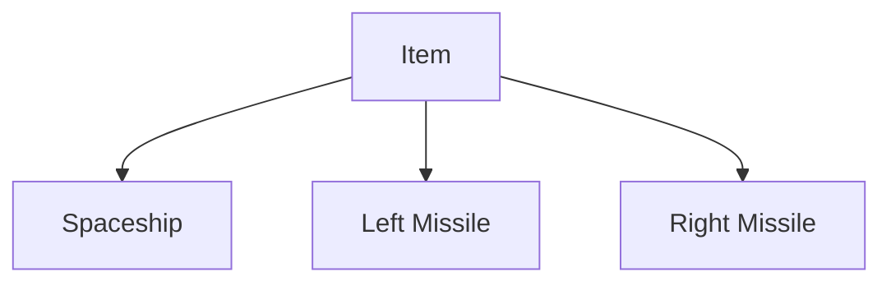

# designPattern
design pattern with cpp

* Interface : 규칙(순수 가상 함수)만 있는 추상 클래스
* 추상 클래스 : 규칙 + 다른 멤버가 있는 추상 클래스

```mermaid
graph TD
A[Item] --> B[Spaceship]
A --> C[Left Missile]
A --> D[Right Missile]
```